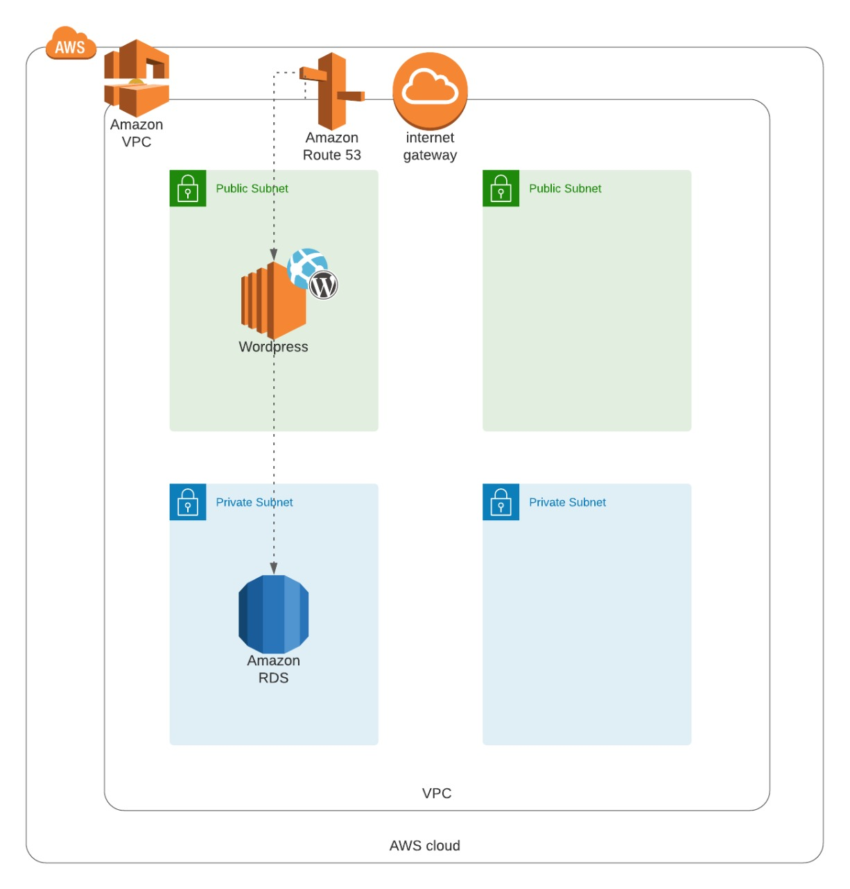
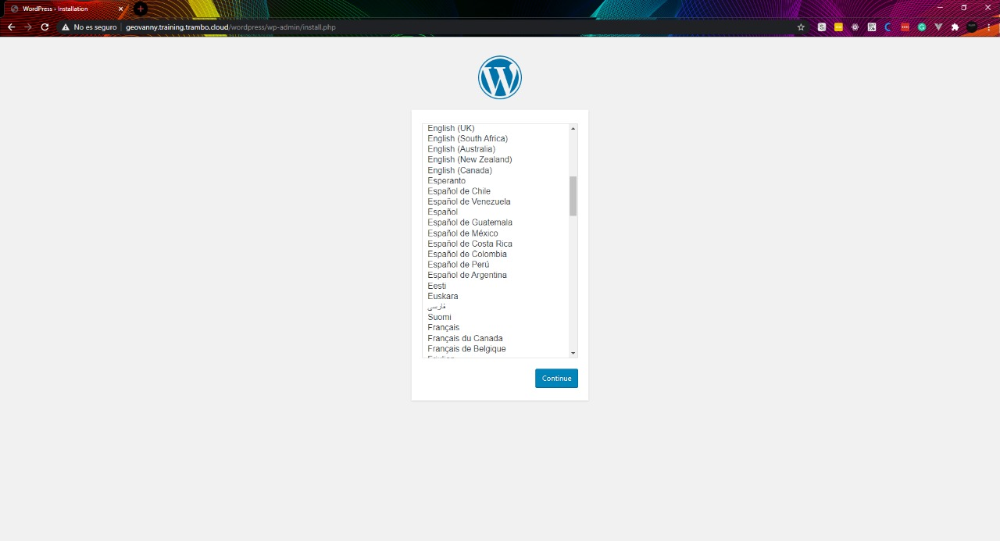

# WordPress Template - Cloudformation

Template to create a WordPress site from scratch, without any manual configuration. The infrastructure is defined using CloudFormation, and containers the following parts:
- Main Template
- VPC
- RDS
- EC2
- DNS Registry

## Usage

Requirements:
- Have a hosted zone created, this will be used to create the DNS record.
- Key Pair created, this will be used to connect using SSH to your instance after created.
- S3 bucket created, this will be used to upload the templates.

Follow the steps:

1. Clone the repository.
4. Upload the files to your bucket and copy the url of the main.yml file.
5. Go to CloudFormation and create a new Stack with the url copied in the last step.
6. Fill the parameters you want to use for your stack
7. Create your Stack!

## License
[MIT](https://choosealicense.com/licenses/mit/)